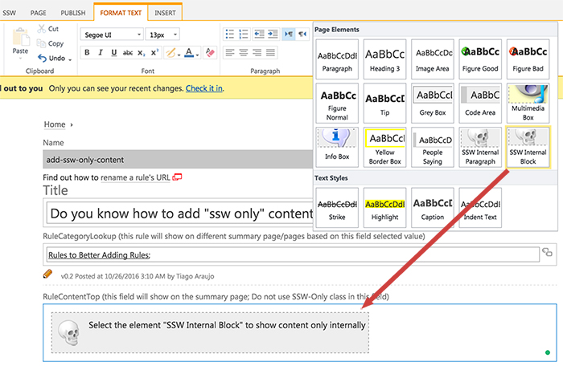
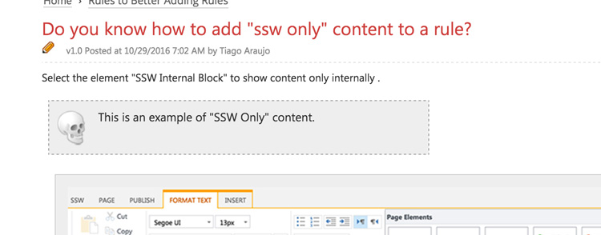
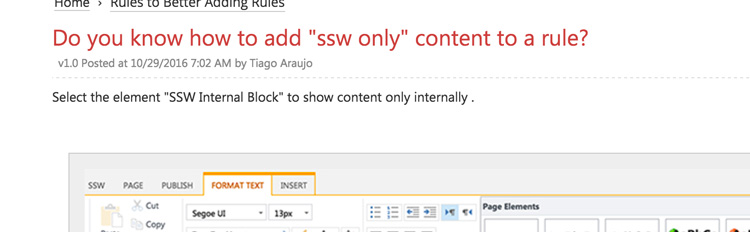

Select the element "SSW Internal Block" to show content only internally.

<!--endintro-->

**Note:** We have "SSW only content block" feature, however, Rules.SSW is a public website, which means technically the content is accessible through API, so please do not use it for confidential or sensitive info.
