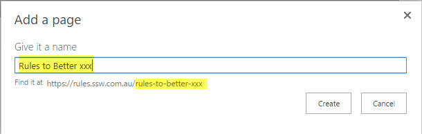
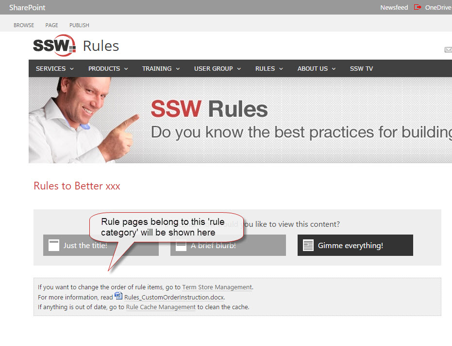

Basically, creating a rule category contains two parts of work.

1. Create a "rule category" in Term Store (e.g. "Rules to Better xxx")
2. Create a "rule summary" page to show all the rule pages belong to this rule category.

<!--endintro-->

 **1. Create a "rule category" in Term Store (e.g. "Rules to Better xxx")**   

> 1) Open browser, log in to [http://rules.ssw.com.au/admin/](/admin)
> 
> 
> 2) Open [https://rules.ssw.com.au/\_layouts/15/termstoremanager.aspx?tsid=eacc332d045a40e1bcc10498d65b767f](/_layouts/15/termstoremanager.aspx?tsid=eacc332d045a40e1bcc10498d65b767f) , under "ImportTaxonomy" | "RuleCategories", find the right "parent category" (e.g. "Communication"), click "Create Term":
> 
> 3) Type the rule category name, e.g. "Rules to Better xxx":

**2.** **Create a "rule summary" page to show rule pages belong to this rule category** 

> 1) Go to "Site Setting" | "Add a page" to create a new page:
> 
> 
> 2) Type the rule category name in the popup dialog (same as the rule category name created in term store, e.g. "Rules to Better xxx"), then click "Create" button:
>  **Figure: a friendly url will be automatically generated** 3) On the new created page, go to "Ribbon" | "Page" | "Page Layout" to change the new created page layout to be "SSW - Rule Summary Page":
> 4) "Check in" and "Publish" this "Rule Summary" page, then you should have a page like below,Figure: Any futher created "rule pages" belong to this "rule category" will be listed on this page
