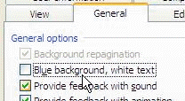

 
Sounds are important to an interface. Sounds provide an extra level of feedback to the user. For example, in Outlook, you can enable sounds, which notify the user when text is copied or pasted, or mail items are received, moved or deleted. Important situations where sounds should be used include:
   ​
Out of the box, you'll get a sound with error messages. You'll still need to add your own for:

- Long process - there should be a sound at the end of every long process to notify the user that it has finished 
- Deleting records
-  [Application opening](http://www.ssw.com.au/ssw/Standards/Rules/Sounds/SSWApplicationOpened_dooropen.wav)  /  [closing](http://www.ssw.com.au/ssw/Standards/Rules/Sounds/SSWApplicationClosed_doorslam.wav) 
- Copying and pasting text

However, not everyone likes sounds, so we think it is also important to have an option to disable sounds in your application.
Figure: Good Example - Turning on Feedback with sound in Outlook
