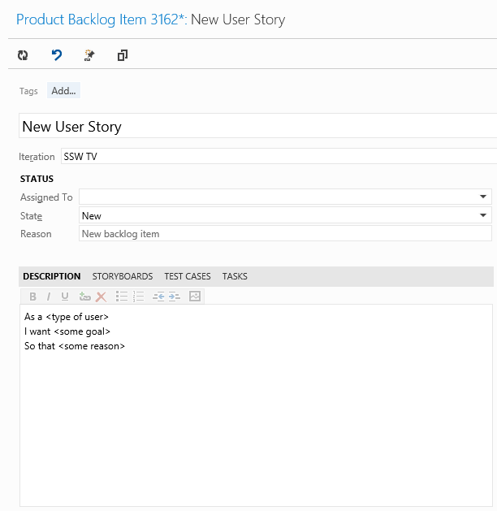

Product Backlog Items (PBIs) can be described in the form of a "User Stories" when appropriate. It ensures the developers will know the context for a PBI.

::: ok  
  
:::  

<!--endintro-->

::: bad  
  
:::  

Figure: Bad Example - the user story is too vague and broad in scope

:::

I want to be able to search for customers.
::: greybox

**Note:** In the TFS Scrum template (since we now have a title, description, and acceptance criteria), we no longer generally need to use User Story formatting.

Figure: Good Example - Clear user story following the INVEST principle

:::
So that I can find their numbers and call customers close to me.
I want to be able to search for customers by country and last name.
As a Marketing Manager...
::: greybox
