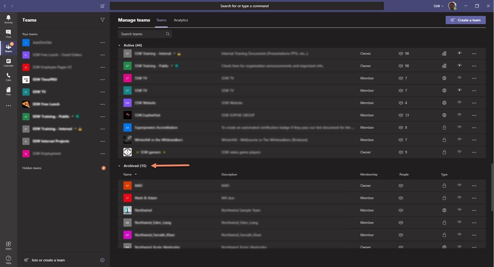
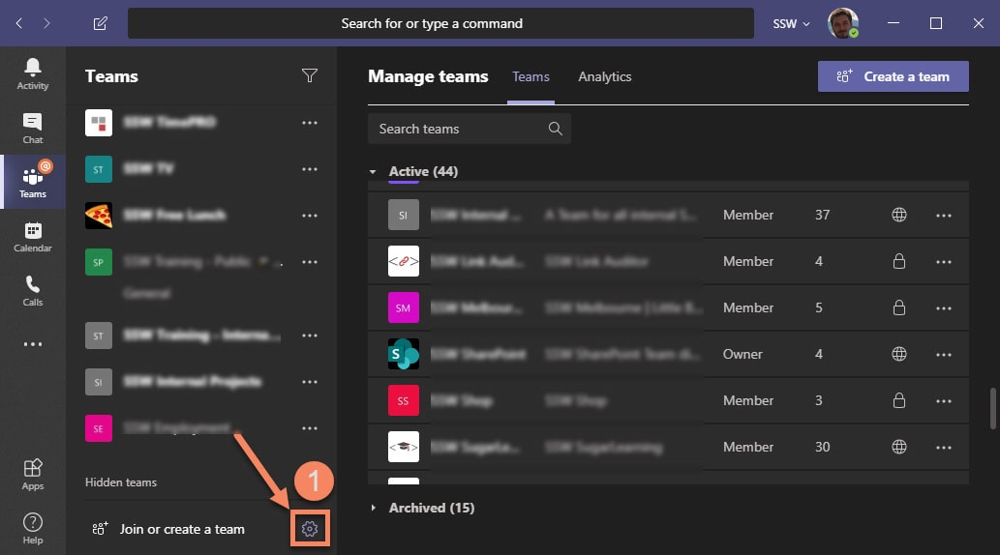
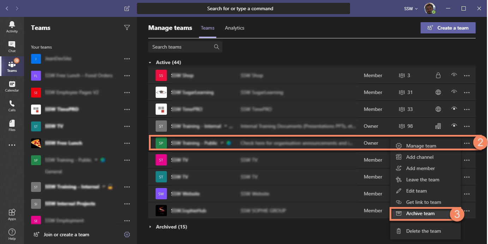

Within a team or project-based organization, the number of Teams can rapidly grow out of control. The more active Teams you have, the harder it gets to find the right information when you need it.

<!--endintro-->

Hiding teams works well enough for end users but doesn't help administrators figure out which teams are actually in use. You should "Archive" unused teams instead – making the team unavailable read-only.

[[badExample]]
| 
[[goodExample]]
| 
To archive a Team, follow these steps:

* Click on "Manage Teams"
* Choose the team you want to archive (you must be owner of that Team)
* Click the "..." (ellipsis)
* Click "Archive team"

**Note:** Archived teams can be restored at any time to be made available again.
