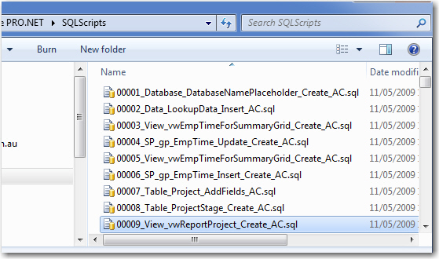

 Let's see how to show the Database version:    
<!--endintro-->

(the table is called \_zsDataVersion). See an example of this in[SSW Link Auditor](http://www.ssw.com.au/SSW/LinkAuditor/)
[SSW Link Auditor](http://www.ssw.com.au/SSW/LinkAuditor/)
(this allows the application to upgrade itself and give the Reconciliation functionality)
