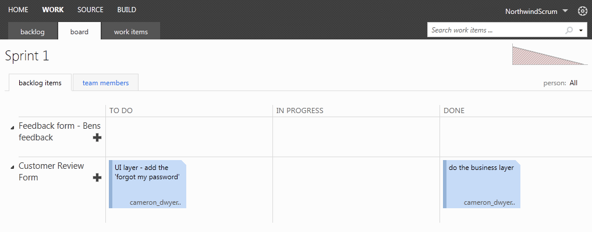

Having     an electronic task board makes it easy for developers to keep track of tasks.

These are the columns (aka swim lanes) you need:

<!--endintro-->

[[goodExample]]
| ()[TFS](http://tfspreview.com/)
[[okExample]]
| 
Near your task board, stick an SSW "Want to submit a User Story?"

* Where to find their project portal
* Who to contact with questions
* How to add tasks to the task board

Print out this PDF and fill in the 2 fields and stick it on own task board.

[
Download the "SSW Submit a PBI" PDF.](/Documents/SSWSubmitaPBI.pdf) 

[User Story Cards here](http://www.ssw.com.au/ssw/Standards/Rules/RulesToBetterProjectManagementWithTFS.aspx#PrintedStoryCard)
