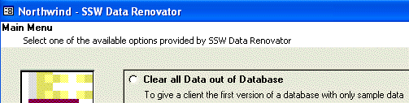

 
Too many developers never change the Title Bar. The Title Bar should reflect the current document in the same way that Microsoft Word, Notepad, etc do.
   ​
Imagine if every email that Microsoft Outlook opened didn't change the title bar. When you were to open a few emails and then take a look in the Taskbar, they would all look the same.

Therefore change the Title Bar to have the current document/customer/job/project/product name that the user is working on. It should be in the format "Document - Program Name", i.e. 'Northwind - SSW Data Renovator'
Figure: Good Example - Application with a standard title bar caption
