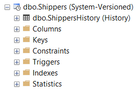

In many cases, there are legal requirements to audit all updates to financial records. In other cases, you will want to be able to track and undo deletes to your database. With the use of Temporal tables, this becomes much easier to manage.

<!--endintro-->

<font color="#333333"><a href="https://docs.microsoft.com/en-us/sql/relational-databases/tables/temporal-tables?view=sql-server-ver15">Temporal tables</a> were introduced in SQL Server 2016 and enhanced with increased features in SQL Server 2017.
They offer the ability to record all the entity changes to a history table allowing the querying of the entity at a point in time.
</font>


::: good
Pros:

:::


* You can query values of a specific entity at a particular point in time or time range over its lifetime.
* Restore accidentally deleted records by retrieving them from the history table.
* Retention period can be set on the history table, this can be set as frequent as 1 day.

 


::: bad
Cons:

:::


* History tables can grow very quickly in size.
* Storing blob datatypes (nvarchar(max), varbinary(max), ntext and image) can increase storage costs and decrease performance.
* You cannot truncate the table.
* Temporal and history table cannot be FILETABLE.
* Direct modification of the data in the history is not permitted.

 
### How do I create a Temporal table?
 It’s actually quite simple, here is a code snippet converting a table from the Northwind schema into a temporal table.


```
CREATE TABLE dbo.Shippers
(
               [ShipperID] int IDENTITY(1, 1) NOT NULL,
               [CompanyName] nvarchar(40) NOT NULL,
               [Phone] nvarchar(24) NULL,
              [SysStartTime] datetime2 GENERATED ALWAYS AS ROW START, [SysEndTime]  datetime2 GENERATED ALWAYS AS ROW END, PERIOD FOR SYSTEM_TIME (SysStartTime, SysEndTime), CONSTRAINT PK_Shippers PRIMARY KEY CLUSTERED
               (             
                              [ShipperID]
               )
)
 WITH (SYSTEM_VERSIONING = ON (HISTORY_TABLE = dbo.ShippersHistory));
```


 **Figure: Shippers table from the Northwind schema converted to a temporal table.
** 
 **Figure: New temporal table shown in SQL Management Studio.
** 
<font color="#333333">
</font>


```
-- Update the tables history data retention
ALTER TABLE dbo.Shippers
SET (SYSTEM_VERSIONING = ON (HISTORY_RETENTION_PERIOD = 7 YEARS));
```


 **Figure: Code snippet for updating data retention.
** 
<font color="#333333"></font>

<font color="#333333">Some alternative solutions are:
</font>

1. Manually adding triggers on all database tables to log every table
2. The business objects or stored procedures all write to 2 tables the main table such as Customer and CustomerAudit
3. Using a logging utility to audit database changes


<font color="#333333">
</font>

This means that you can devote your development time to areas other than auditing. Also, unlike other utilities which use triggers (such as [ApexSQL Audit](https://www.ssw.com.au/ssw/Redirect/ApexSQL.htm)), there is no performance overhead because it relies upon log files already created by SQL Server. If required, you can export the log information to SQL Server, so you can perform advanced queries on it. It even allows you to recover previously deleted tables.
