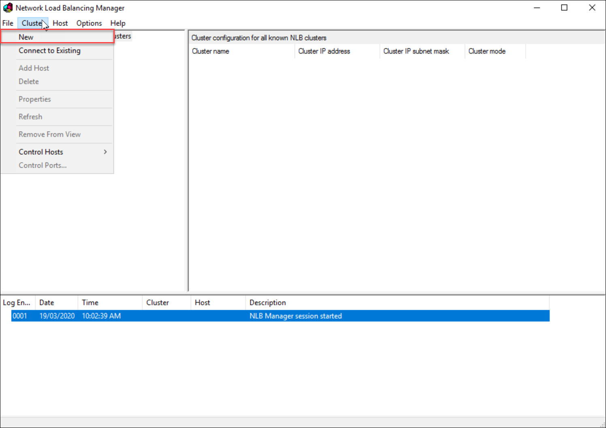
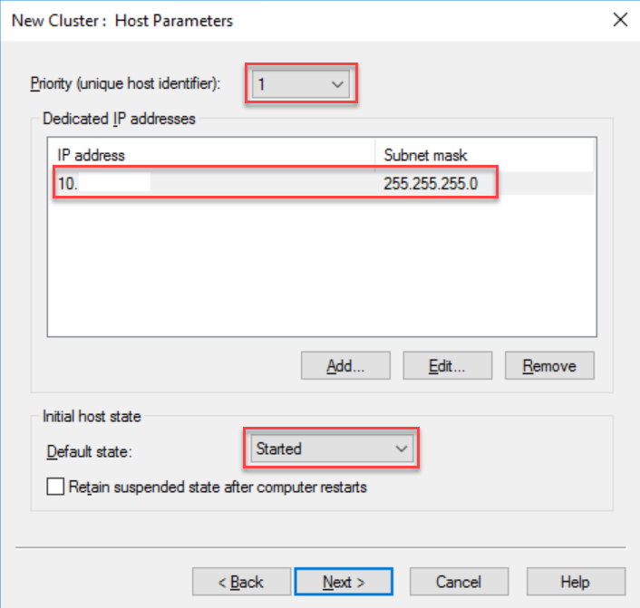

Downtime occurs when you have a single server setup.

**TODO: This is 2008 R2 – update to 2016** 
 **Note:** 2008 R2 was not as reliable as later versions. So it would be better to use failover cluster in Server 2012 R2 or 2016 for a more reliable infrastructure configuration.

Use NLB to allow load balancing and failover. On each of your Windows Servers, you will host your website.

You need to follow these steps to get it up and running:

<!--endintro-->

1. On all nodes of the NBL cluster, the Network Load Balancing Feature needs to be installed.
**Figure: Install the NLB Feature**
2. Open the Network Load Balancing Manager from Administrative Tools
**Figure: Under the Cluster menu item, click New**
3. Enter the first node in the cluster in ‘Host’ and press ‘Connect’
**Figure: Select the interface for the node**
4. Enter a Priority as 1 (this is just a host identifier)
**Figure: In 'Priority' enter '1'**
5. **Figure: Enter a virtual IP address for the cluster. eg. 192.168.1.12**
6. Choose the IP address of your cluster from the dropdown list Set a Full Internet Name eg. spcluster.sydney.ssw.com.au. 
Ensure the Multicast Cluster operation mode is selected.
**Figure: Set the 3 cluster parameters**
7. You want sticky sessions so you don’t mistakenly bounce between servers (and lose your state)
**Figure: Leave the Port Rule as default. This will provide sticky session** 
**Figure: Success. The cluster configuration will show a green icon**
8. Right click the name of the cluster eg. spcluster.sydney.ssw.com.au Click Add Host To Cluster
**Figure: Add the 2nd web server with a priority of 2**
9. Open a command prompt and type in wlbs query to verify the cluster:
**Figure: Type in wlbs query to verify the cluster**
10. Ping both nodes and the virtual IP address externally to verify they are all working
