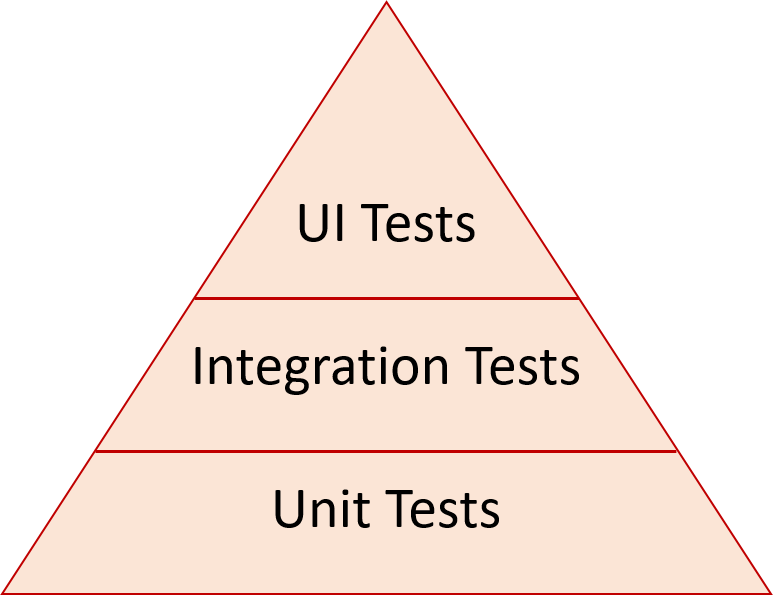

Here are some of the common techniques used for testing software.

<!--endintro-->

### Smoke test

* You fire up your application and click around prior to giving it to a tester. Most developers do this.

### Unit Tests

* They are coded by a developer
* Quick
* Independent
* Test just 1 behaviour in isolation
* Tip: Use mock objects to make it faster and not to be bothered by external dependencies eg. the web service going down. The popular ones are Moq and nSubstitute

### Integrations Tests

* They are coded by a developer
* Slower
* Test the interaction of components eg. Databases, Web Services

### Functional Tests

* Verifies the functionality of a system, typically from an end-user perspective
* Can be performed manually or executed using an automated framework see [https://rules.ssw.com.au/microsoft-recommended-frameworks-for-automated-ui-driven-functional-testing](/microsoft-recommended-frameworks-for-automated-ui-driven-functional-testing)

### Subcutaneous Tests

Subcutaneous (as in just benath the skin) are a type of integration/functional test that operate just below the UI -  and are good for automated functional testing that would otherwise be difficult to achive by manipulating the UI itself.

* Written by developers
* Test the full underlying behaviour of your app but bypasses the UI
* Requires business logic to be implemented in the API / middle layer and not in the UI.
* Tests can be much easier to write than using technologies that drive a UI (such as Selemium)

### Load Tests

* Setup by developers
* Simulate expected load on your application
* Use the performance stats as a baseline for regression. You don't want to decrease performance in your application.
* Tip: try to execute these from the cloud

### Stress Tests

* Setup by developers
* Hit your application very hard, and try to see where your limits are (CPU, Network, Memory)

### The Testing Pyramid

 **Figure: the testing pyramid** 

The concept of a testing pyramid was introduced by Mike Cohn.

It's a metaphor that gives a guideline on how many tests we should write in each area.

At the bottom of the pyramid are small, isolated unit tests. These should be simple, easy to write and fast to execute. Our projects should aim to have many of these tests. As you move up the pyramid, complexity (such as the number of involved services) increases. So these tests become progressively harder to wite and slower to run. You should aim to write fewer tests as you move up the pyramid.
