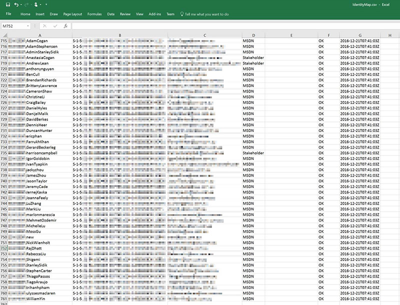

When migrating from TFS to the cloud you will find that a list of historical users may be quite long.
 

Many of these users are likely to be gone but they are preserved in TFS for historical purposes. What are you going to do with them? 
**A)** All account stays active (total 700 in AD) – this is a hard one because you need to bring all accounts in Azure AD and generally you don’t need those users
**B) ** Old employees are carried over as phantom  (so only 40 are migrated) – Recommended because you will still see the history but not those accounts are not active anymore
       Eg. If Paul Stovell comes back he needs a new account (because you can't reuse the SID)
